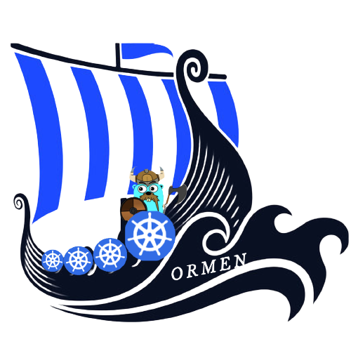

# Ormen 
[](https://github.com/ashish493/ormen/issues)
<!-- [](https://goreportcard.com/report/github.com/casbin/k8s-authz) -->
[](https://opensource.org/licenses/Apache-2.0)

<p align="center">
    
</p>

Ormen is a toy Orchestrator written in go based on Vikings theme. 

## Installation 

```
go get github.com/ashish493/ormen
```

## Requirements
Since we are orchestrating the Docker containers, we need a running Docker Daemon before running this application. 

## Relation between ships and orchestrator


## Usage

1. Use `go run main.go` to get the list of available commands.

```
$   go run main.go 

    A CLI based toy orchestrator used to manage docker containers written in go.

    Usage:
    ormen [command]

    Available Commands:
    deck        command to operate a manager node.
    help        Help about any command
    mast        Mast command to list nodes.
    run         Run a new task.
    sailor      Worker command to operate a Cube worker node.
    status      Status command to list tasks.
    stop        Stop a running task.

    Flags:
    -h, --help   help for ormen

    Use "ormen [command] --help" for more information about a command.
```

2. Use `go run main.go sailor -p 8081` to setup a sailor node at a specific port number. The default port number of sailor is 5556.

```
$   go run main.go sailor -p 8081
    2023/11/10 18:26:02 Starting worker.
    2023/11/10 18:26:02 Starting worker API on http://0.0.0.0:8081
    api started2023/11/10 18:26:02 No tasks to process currently.
    2023/11/10 18:26:02 Sleeping for 10 seconds.
    2023/11/10 18:26:02 Collecting stats
    2023/11/10 18:26:02 Checking status of tasks
    2023/11/10 18:26:02 Task updates completed
    2023/11/10 18:26:02 Sleeping for 15 seconds
    2023/11/10 18:26:12 No tasks to process currently.
    2023/11/10 18:26:12 Sleeping for 10 seconds.
```

3. Use `go run main.go deck -w 'localhost:8080,localhost:8081,localhost:8082'` to setup a deck for the respective sailor nodes. The default port number of deck is 5555.

```
$ go run main.go deck -w 'localhost:8080,localhost:8081,localhost:8082'
2023/11/10 18:37:47 Starting manager.
2023/11/10 18:37:47 Starting manager API on http://0.0.0.0:5555
2023/11/10 18:37:47 Checking for task updates from workers
2023/11/10 18:37:47 Checking worker localhost:8080 for task updates
2023/11/10 18:37:47 Processing any tasks in the queue
2023/11/10 18:37:47 No work in the queue
2023/11/10 18:37:47 Sleeping for 10 seconds
2023/11/10 18:37:47 Performing task health check
2023/11/10 18:37:47 Task health checks completed
2023/11/10 18:37:47 Sleeping for 60 seconds
2023/11/10 18:37:47 Collecting stats for node localhost:8080
2023/11/10 18:37:47 Checking worker localhost:8081 for task updates
2023/11/10 18:37:47 Collecting stats for node localhost:8081
2023/11/10 18:37:47 Collecting stats for node localhost:8082
``` 


4. Use `go run main.go stop bb1d59ef-9fc1-4e4b-a44d-db571eeed203` to stop 

5.  Use `go run main.go mast` to get the list of nodes.  
```
$ go run main.go mast 
NAME               MEMORY (MiB)     DISK (GiB)     ROLE       TASKS     
localhost:8080     7967             1081           worker     0         
localhost:8081     7967             1081           worker     0         
localhost:8082     7967             1081           worker     0
```


4. Use Curl operations on deck's server to perform CRUD Operation on containers and also to view nodes.

```
$ curl -X POST localhost:5555/tasks -d @task1.json

{"ID":"bb1d59ef-9fc1-4e4b-a44d-db571eeed203","ContainerID":"","Name":"test-chapter-9.1","State":1,"Image":"timboring/echo-server:latest","Cpu":0,"Memory":0,"Disk":0,"ExposedPorts":{"7777/tcp":{}},"HostPorts":null,"PortBindings":{"7777/tcp":"7777"},"RestartPolicy":"","StartTime":"0001-01-01T00:00:00Z","FinishTime":"0001-01-01T00:00:00Z","HealthCheck":"/health","RestartCount":0}

$ curl -X DELETE localhost:5555/tasks/bb1d59ef-9fc1-4e4b-a44d-db571eeed203

$ curl localhost:5555/nodes|jq
[
  {
    "Name": "localhost:8080 ",
    "Ip": "",
    "Api": "http://localhost:8080 ",
    "Memory": 32793076,
    "MemoryAllocated": 0,
    "Disk": 20411170816,
    "DiskAllocated": 0,
    "Stats": {
      "MemStats": {...},
      "DiskStats": {...},
      "CpuStats": {...},
      "LoadStats": {...},
      "TaskCount": 0
    },
    "Role": "worker",
    "TaskCount": 0
  }
]

```

You can refer the [task1.json](https://github.com/ashish493/ormen/blob/main/task1.json) to create or update the Sails. 


## Acknowledgement